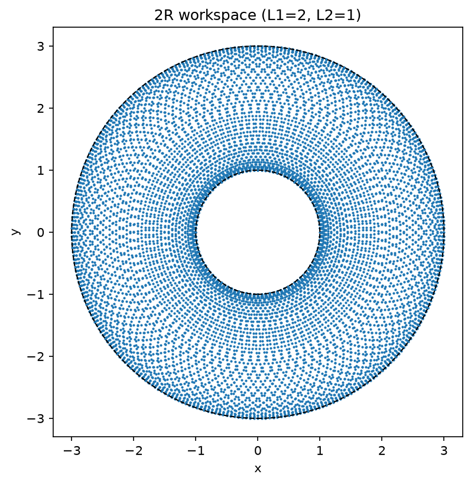

learning robotics from the book "Modern Robotics" by Kevin Lynch.

all the c++ in ch02/arm2r/src, include and tests is handwritten by me. AI helped with the cmake/build setup, file organization, the csv dump in ch02/arm2r/examples/sample_workspace.cpp, and the plotting in ch02/arm2r/scripts/plot_workspace.py.

## ch02 - configuration space

2R arm: angle wrapping, angular distance on S1, C-space distance on the torus T2, forward kinematics, and workspace sampling with a property test.



```sh
cd ch02/arm2r
cmake -S . -B build && cmake --build build
ctest --test-dir build --output-on-failure
./build/sample_workspace | python3 scripts/plot_workspace.py
```
